# 使用文档 - 告警管理使用手册

这是一篇使用文档，介绍了平台告警管理模块使用步骤和方法。

## 主要流程

* 创建告警器
* 获取需要被监控的工作流密钥 
* 创建告警任务

## 创建告警器

* 打开告警设置

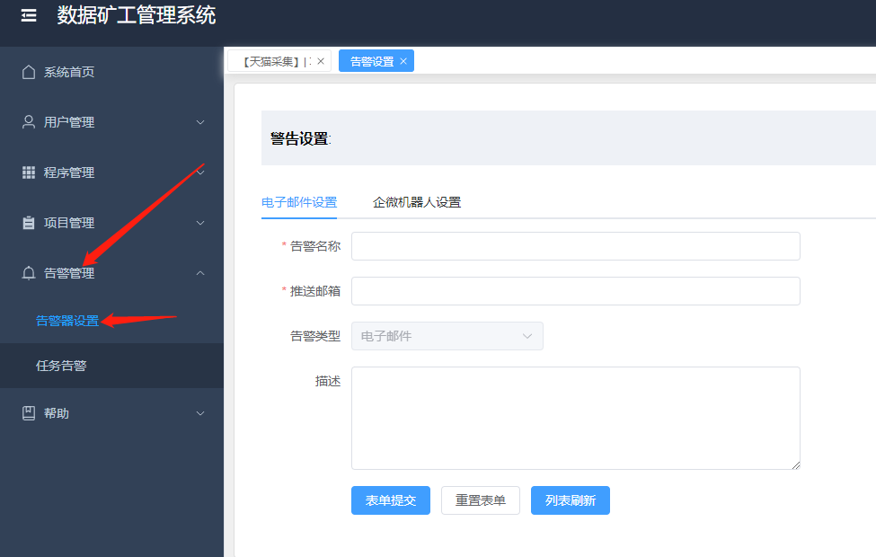

* 告警器，分为两种类型：

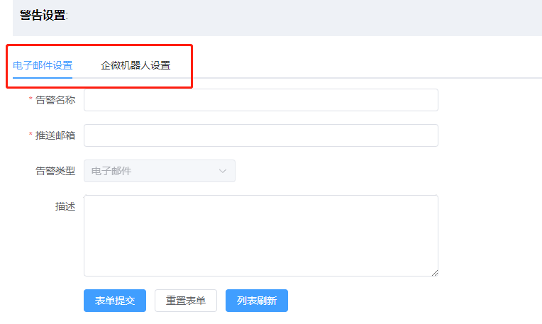

### 电子邮件设置

* 表单要求和自身的需要，填写设置信息

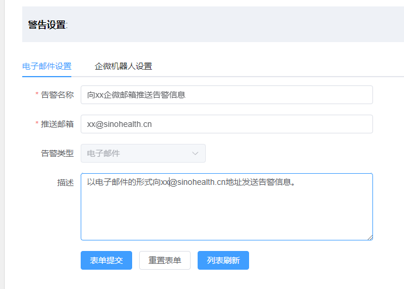

如图，创建了一个向xx@sinohealth.cn地址发送告警的告警器。
推送邮箱的地址，创建以后是不可更改的。
该告警器是可复用的，任何想要给该邮箱发送告警信息的工作流，都可以使用它。

### 企微机器人设置

* 进入企业微信，进入想要发送通知的群组，依次打开菜单选项
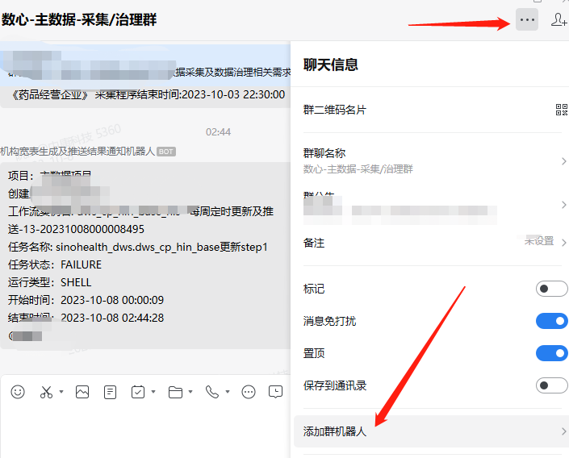

* 点击添加群机器人
  
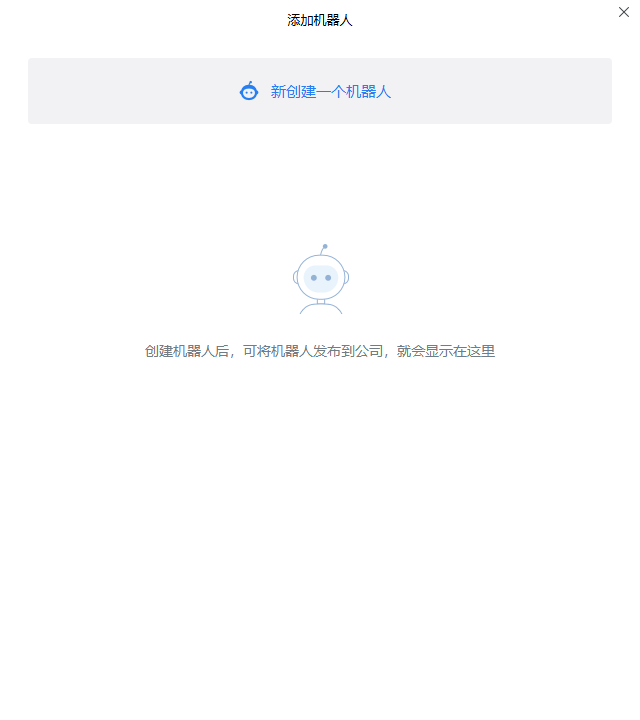

* 新创建一个机器人，点击添加

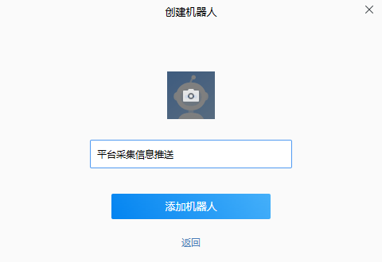

* 获取到Webhook地址，将该地址key=后的密钥复制下来，保存

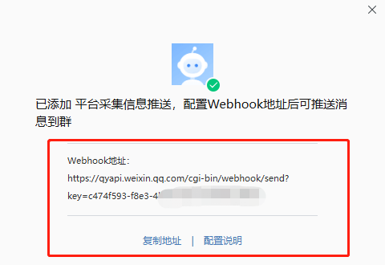

* 如图，在告警器设置上填写相应信息，保存。Webhook保存下来的key填入企微密钥即可。

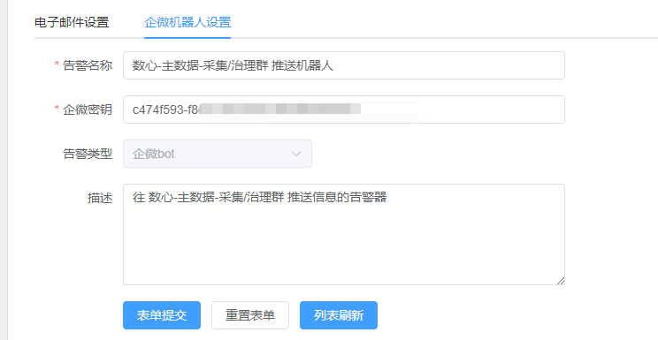

###  查看告警器列表

* 填写完告警器设置，点击提交表单，保存成功以后点击刷新列表即可
* 不同类型的告警器保存在不同的列表

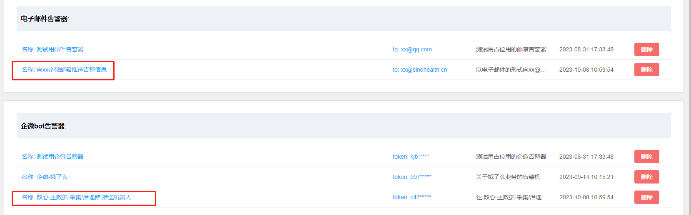

## 获取需要被监控的工作流密钥 

* 根据文档 《如何获取工作流密钥》 的最后几步获取到工作流密钥即可。

## 创建告警任务

* 打开任务创建窗口

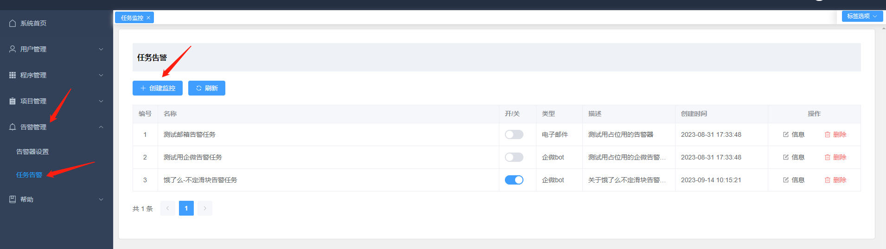

* 填写任务创建信息，点击确定，即可

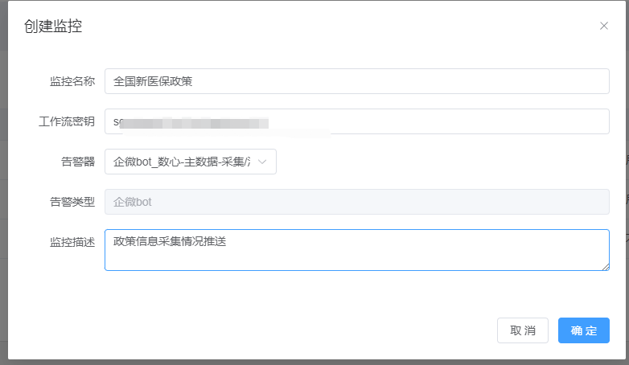

* 当任务日志中出现error等级的错误，就会根据告警器设置自动发生该条日志
* 当暂时不想监控该工作流时，可以点击开关，暂时关闭。

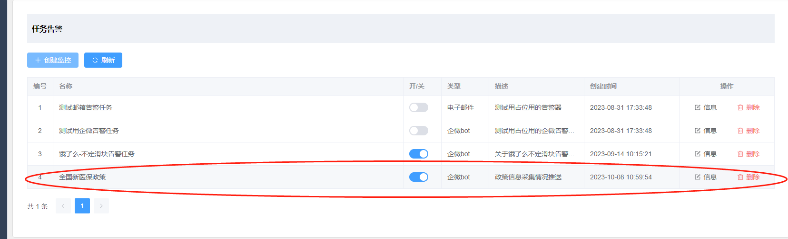

