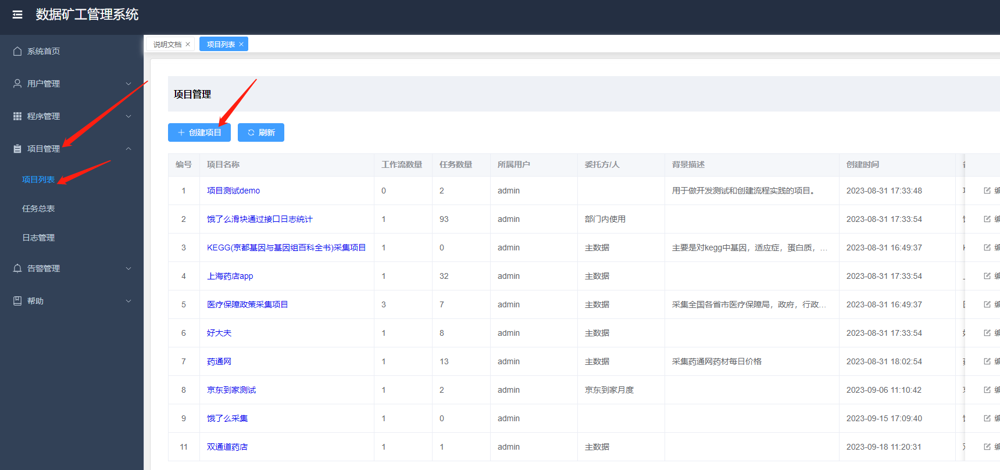
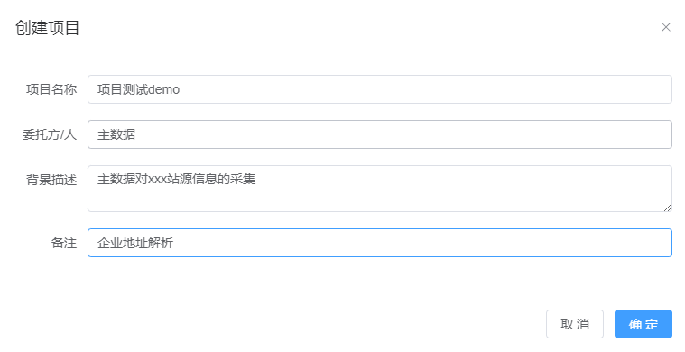
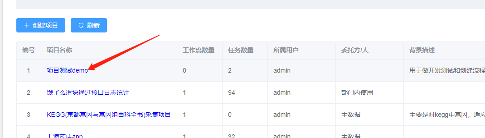
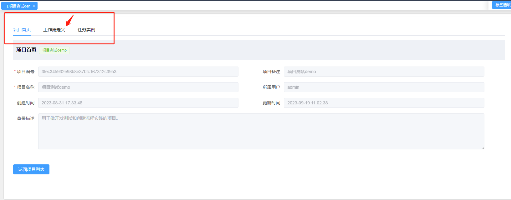
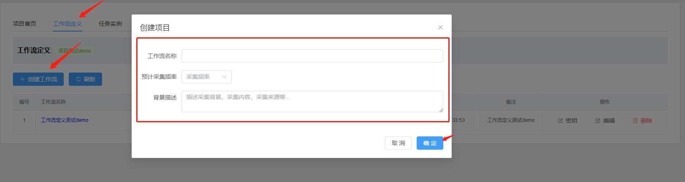
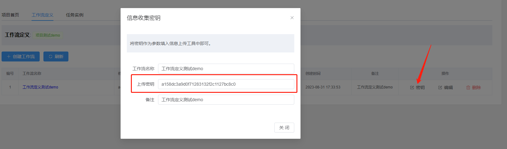
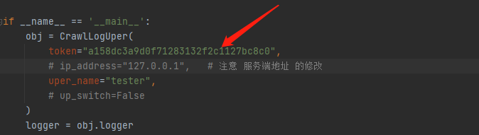
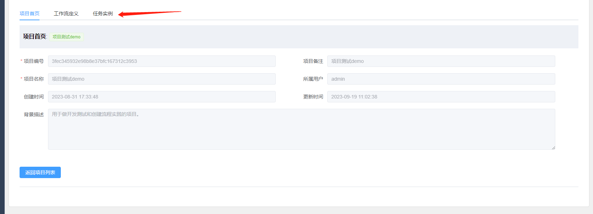
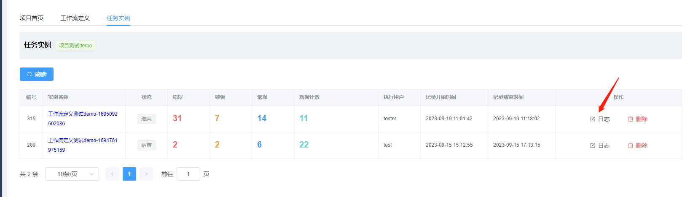
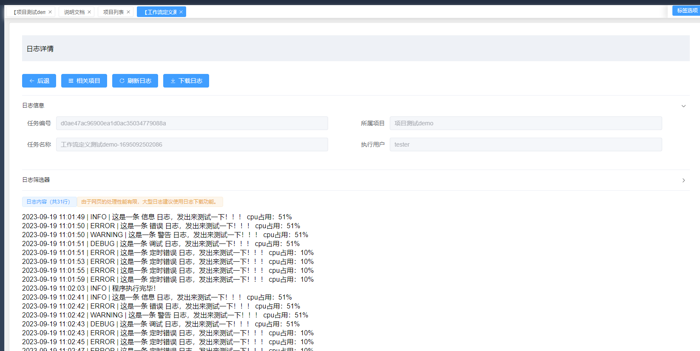

# 使用文档 - 如何获取工作流密钥 Version-1.1

本文用于介绍，如何通过平台获取工作流密钥的操作流程进行介绍。

# 背景

日志推送器的使用，需要填入token用来定位任务的归属。而密钥的来源需要从平台上获取。

# 已知的问题

项目重启或刚部署时，由于部分页面尚未访问，页面缓存没有产生。
导致首次打开网页时会有卡顿，待缓存生成后，即可。

# 操作流程

* 打开网页平台地址：

```text
    http://192.168.16.15:50831
```


* 使用账号进行登录

```
联系系统管理员，来为你开通账号和密码。
使用账号密码登录即可。
```

* 创建项目和工作流

依次操作：

```text
项目管理 => 创建项目 => 填写相关信息，确定提交; 
```




项目创建完成,进入项目详细，创建工作流：
```text
点击项目列表的项目名称进入项目详细 => 工作流定义
```




```text
创建工作流 => 填写相关信息，确认提交 => 在列表中点击"密钥"按钮
```

复制上传密钥，放到推送器中即可。




* 启动推送器，查看任务信息和日志
```text
项目详细 => 任务实例 => 查看日志信息或点击"日志"按钮
```




# 注意事项
日志查看页，仅提供简单的日志概览和检索功能。
当日志内容超过5000行以上时，建议将日志下载导出，在本地查看分析更好。
平台页面对超长文本的处理性能有限。
